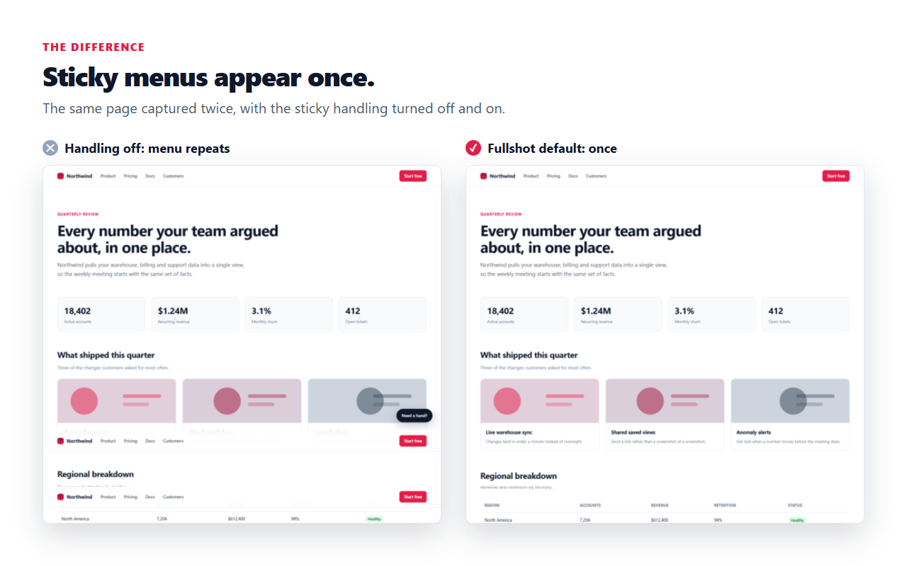

<p align="center">
  
</p>

<h1 align="center">Fullshot</h1>

<p align="center">
  Full page screenshots that get the hard pages right.<br />
  Chrome and Firefox. No account, no paywall, no tracking, no network access.
</p>

---

Most full page screenshot tools work fine on a simple article and fall apart on the
rest of the web: the sticky nav gets stamped into the image once per screen, images
below the fold come out blank, and a very long page silently produces an empty file.

Fullshot is built around those failures.

## What it does differently

**Sticky and floating elements appear once.** A `position: sticky` header is returned
to its natural place in the document, so it shows up where it belongs. A
`position: fixed` bar is classified by the edge it is docked to and drawn only on the
first or last screen. No repeated navs, no cookie banner tiled down the page.



**Images are loaded before anything is captured.** The page is swept top to bottom
first so `IntersectionObserver` fires and lazy images decode, then fonts and images
are awaited under a timeout. No blank bands.

**Slices are placed where the page actually landed, not where it was told to go.**
After every scroll the real offset is read back. Browsers clamp the last scroll of a
page, which is exactly what produces seams and duplicated strips in naive stitchers.
Measuring instead of assuming makes that overlap harmless.

**Very long pages do not silently fail.** An oversized canvas in Chrome does not throw,
it just stops accepting draws, which is how a long page turns into a blank image.
Fullshot probes the real canvas limit of your machine at runtime and either scales to
fit and tells you, or exports as a paginated PDF where no huge canvas is needed.

**Pages wider than the viewport work.** Capture is a grid, not a column.

**Inner scrolling panes work.** The real content in mail and chat apps lives in a
`overflow: auto` div, not the document scroll. Fullshot can target it.

**The scrollbar is cropped out**, animations are paused so nothing tears between
slices, parallax backgrounds are pinned, and `scroll-behavior: smooth` and scroll-snap
are overridden so programmatic scrolling lands exactly where it is told.

**It tells you when something could not be captured.** Cross-origin frames, DRM video,
a page that changed height mid-capture, or a downscale applied to fit a canvas limit
are all reported rather than quietly baked into the image.

## Text legibility

Long pages sometimes have to be scaled down to fit within your browser's maximum image
size, and that is exactly when small text starts to smear. Turn on **Sharpen text**, in
settings or per screenshot in the editor, and Fullshot applies an unsharp mask with a
gentle contrast curve at one of three strengths.

It sharpens what was captured; it never upscales or invents pixels, because that makes
text look worse and would misrepresent what was actually on screen.

## Editor, included

Crop, black out, pixelate, arrows, boxes and text, with undo and redo. Export PNG,
JPEG, WebP or a paginated PDF, or copy straight to the clipboard. None of it is behind
a paywall, because there is no paid tier.


## Permissions

```json
"permissions": ["activeTab", "scripting", "storage"]
```

That is the whole list. There are **no host permissions**, so Fullshot cannot read any
site until you actually click its button or press its shortcut on that tab, and that
access ends when you navigate away.

It makes **no network requests of any kind**. Not analytics, not error reporting, not a
version check. The build fails if a network primitive or a broad host permission ever
appears in the source, so this is enforced mechanically rather than promised:

```bash
npm run check
```

Screenshots are held in your browser's own storage only until the editor opens them,
and anything older than a day is discarded.

## Install

On the [Chrome Web Store](https://chromewebstore.google.com/detail/fullshot-full-page-screen/fbhdnoklfeahhmmdmiblndcjmeagjfci).
For Firefox, on [addons.mozilla.org](https://addons.mozilla.org/firefox/addon/fullshot-full-page-screenshot/).

To run it from source:

**Chrome or Edge**: go to `chrome://extensions`, turn on Developer mode, choose
"Load unpacked", and choose `dist/chrome`.

**Firefox**: go to `about:debugging#/runtime/this-firefox`, choose "Load Temporary
Add-on", and choose `dist/firefox/manifest.json`.

Firefox 140 or newer is needed. Tab capture only started accepting `activeTab` in
126, and Fullshot will not ask for the `<all_urls>` that older versions demanded; 140
is where Firefox's needed data collection declaration became supported.

## Build

No dependencies, no bundler.

```bash
npm run build      # dist/chrome and dist/firefox
npm test           # unit tests for the capture geometry and PDF writer
npm run check      # release gate: permissions, icons, no remote code, no network
npm run zip        # store-ready zips in release/
npm run all        # build, zip, gate and tests
npm run icons      # re-rasterise the icon PNGs (only after editing icon.svg)
```

There are six end-to-end harnesses, all driving a real browser with no test
framework.

`npm run e2e` loads the built extension, captures `test-pages/torture.html`, and
checks the result pixel by pixel. The fixture encodes each block's index in its own
red channel, so a misplaced, duplicated or dropped slice shows up as the wrong colour
at a known height instead of a screenshot that merely looks plausible. It checks that
the sticky header appears exactly once, that the fixed footer is not repeated, and that
all twenty blocks landed at the correct offset.

`npm run e2e:modes` checks the other three capture modes: that a visible-area
capture is viewport sized and not stretched onto a page-sized canvas, that an
element captured from the middle of a page contains that element and nothing
else, that picking an element pinned to the window returns that element rather
than the page behind it, and that a scrolling panel is scrolled and stitched
across its full content. It runs the panel case twice, once on a pane smaller
than the window and once on a pane taller than it, because a pane taller than
the window runs out of its own scroll before the last screenful has been shown.
It also captures a page three times wider than the viewport, laid out both left
to right and right to left, which is what covers the multi-column tile grid, and an
element far taller than the panel showing it, which is the case where capturing the
element's whole box photographs the page behind the panel instead.

`npm run e2e:scroll` captures a page that fights back: it hijacks the wheel, undoes
programmatic scrolls and moves itself while it is being read.

`npm run e2e:overlay` proves Fullshot never photographs its own progress card. It
wraps the capture API and asks the page, at the instant of every photograph,
whether the card is still up, then checks that a flat-coloured page comes back
containing nothing but that colour. Asking the page is the point: a path that takes a
photograph and later discards it still leaks on the browser where that photograph is
kept, so a pixel check alone would call a broken build clean.

`npm run e2e:popup` covers the two things the popup does that cannot be seen from
inside it. A capture started from the keyboard has no popup to fail in front of, so
the background flags the toolbar button and parks the message for the next popup to
read; the check confirms the message is shown and that the flag comes off the tab it
was set on. It also confirms the keyboard shortcut the popup advertises is the one the
browser really bound, and runs a second build whose commands are declared but bound to
nothing, which is what a refused or cleared key looks like.

`npm run e2e:tools` drives every editor tool with real synthesised mouse and keyboard
input and asserts on the resulting canvas: that Move changes nothing, that Box draws a
hollow outline, that Arrow's head is a solid filled triangle, that Text commits exactly
once whether you press Enter or click away, that Redact is genuinely opaque black, that
Blur destroys fine detail without blanking the region, that Crop resizes correctly and
leaves annotations anchored to the image, and that Undo reverses it.

> Branded Google Chrome now refuses `--load-extension`, so the harnesses drive Edge or
> Chromium. Same engine, same result.


## How it is put together

```
src/
  background.main.js   orchestration, capture loop, stitching
  content/agent.js     page preparation, floating-element policy, scroll driver
  lib/plan.js          capture geometry, pure and unit tested
  lib/scheduler.js     quota-adaptive capture pacing
  lib/canvas-budget.js runtime canvas limit probing
  lib/pdf.js           dependency-free multi-page PDF writer
  lib/enhance.js       unsharp mask and contrast curve for text legibility
  editor/              preview, annotation, export
```

Chrome runs the background as a service worker and Firefox as an event page. Both
support `OffscreenCanvas`, so stitching happens in the background either way and the
Chrome-only `offscreen` API is not needed. `tools/build.mjs` emits both manifests from
one source.

`PLAN.md` documents the architecture, the platform facts each decision rests on, and
which of those were checked against primary documentation rather than assumed.

## Support

Fullshot is free, has no paid tier and collects nothing. If it saved you some
time, you can [buy me a coffee](https://buymeacoffee.com/judeh1l).

## Licence

MIT. See [LICENSE](LICENSE).
